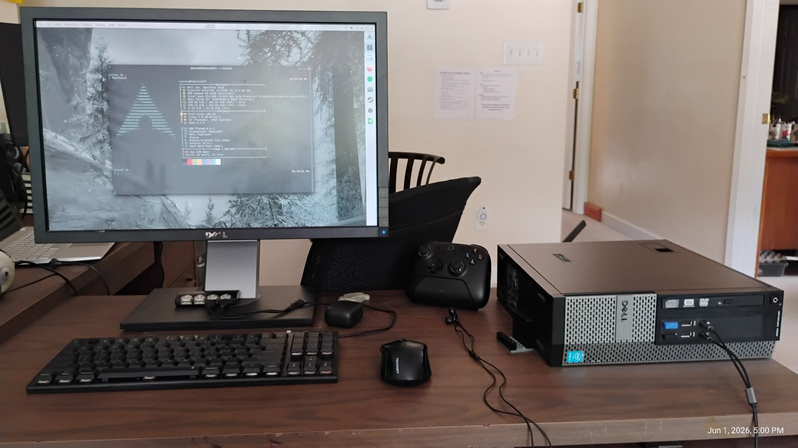

<!-- Home -->
<article role="tabpanel" id="home">

# {{ title }} - Personal Website

Hi, I'm Ezra Snow, or "EJSnow" online. I'm what you would call an unprofessional nerd. I enjoy Linuxing, playing video games, and I'm learning coding. I currently daily drive Arch Linux, having previously used Windows and tried several other Linux distros in between (Microsoft ending support for Windows 10 drove me to Linux). I'm hopelessly nostalgic for Windows 7 and wish I could still use it.

Check out the pages above for more! This site is probably going to be more static but once in a while I write a blog post or have a new project to share.

## My main PC (The Redstone PC)

This is my main computer that I use for most things, primarily gaming on Linux. See the [detailed build overview](blog/2024-10-05-redstone-pc/) for more information.

</article>

<!-- About me -->
<article role="tabpanel" id="about-me" hidden>

# About me

I'm Ezra Snow, an (extremely) nerdy guy who may be addicted to computers and Linux and video games (all of which I spend far too much time playing with...). I live in North Carolina, but this fall I'm heading to college in East Texas to study computer science. Aside from video games and Linuxing, I'm also learning coding and I like reading.

I also strongly dislike just about any piece of technology/software that came out since 2020 because most of them are annoying in that they refuse to respect your privacy and refuse to acknowlege you as the owner. I'm also highly mistrustful of cloud/streaming services and try not to use them when possible (one exception is Spotify because it will take a while to gain a large enough local music collection to move off Spotify). I plan to eventually experiment with self-hosting and building a homelab, but this is something I can't really do right now because hardware is too darn *expensive*.

If anyone's curious, here are my favorite video games, in no particular order:

* The Elder Scrolls V: Skyrim
* Minecraft
* Geometry Dash (technically I hate this game but at the same time I love it but I hate it)
* Hollow Knight
* Forza Horizon 4
* Just Shapes & Beats

Games I want to play (but haven't bought yet for one reason or another):

* FH5 & FH6
* Celeste
* Ori and the Blind Forest
* Ori and the Will of the Wisps
* TES IV: Oblivion
* TES III: Morrowind
* Elden Ring

My all-time favorite book series is Lord of the Rings, but a close second is Swallows and Amazons. Check it out. Seriously.

## My computers

*Click any picture below to enlarge it*

### The Redstone PC

This is my main PC. It's a gaming rig first and foremost, but it's also where I store most of my data and it used to be where I did a lot of my experiments with coding and Linux, but I do most of that on my laptop now. I built it in October 2024 and it works surprisingly well for being an old Dell Optiplex with a modern bottom-tier GPU shoved into it and awful thermals overall. My full writeup on that computer is [here](blog/2024-10-05-redstone-pc/).

Specs (original → upgraded):

* CPU: Intel Core i5-4590 → Intel Core i7-4790
* RAM: 8GB (2x4GB) DDR3 → **Crucial 16GB (2x8GB) DDR3**
* GPU: Intel HD 4600 (iGPU) → **Radeon RX 6400**
* Storage: 128GB 2.5" SSD → **500GB Crucial MX500 2.5" SSD + 1TB Western Digital Blue 2.5" HDD**
* OS: **Arch Linux** + Windows 10 Pro

Items in bold are considered to be significant upgrades.

### Twilight (my laptop)

Twilight is a Lenovo Ideapad Flex 5 15IIL05 laptop that I got for free in August 2025 from my grandparents. They had just bought a new one and didn't need it anymore, plus the keyboard was mostly dead. I discovered the keyboard literally just needed to be cleaned very, very well and then it's worked flawlessly since then. I use it for just about anything aside from most gaming as it's not great at that (but it's usable for a few lighter games like GD and Minecraft and I also got Skyrim to run pretty well at 720p with some settings tweaks). Particularly I use it for coding and playing around with Linux (an unfortunate casualty of that is that I finally `rm -rf /*`'d myself in May). Overall, Twilight is great and it should last me quite a while. Its battery is still quite solid too.

Specs:

* CPU: Intel Core i7-1065G7
* RAM: 16GB LPDDR4
* GPU: Intel Iris Plus G7 (iGPU)
* Storage: Smasnug PM991 512GB NVMe SSD
* OS: Windows 10 Home → Windows 11 Home → **Arch Linux**

### My old laptop

This was my main and only PC until I built the Redstone PC. It was originally my mom's laptop, but she upgraded a long time ago and eventually this laptop got passed to me. I used it from 2022 to 2024 just as a regular PC, and it was my introduction to PCs, Windows, PC gaming, and the wide wide world of the Internet (Up until I had that PC I didn't do much on the Internet although I had an Android tablet before). I even started experimenting a little bit with Linux in the summer of 2024, but my experimentation was pretty limited.

After it was retired from regular PC duty, I actually hosted a Minecraft server with it in 2025 and that was very cool. I started it in February and it lasted until about November, when I shut it down because no one was playing on it anymore. Eventually it's going to turn into a Windows 7 nostalgia PC.

Specs:

* CPU: Intel Core i7-3540M
* RAM: 8GB DDR3 → 16GB DDR3
* GPU: Intel HD 4000 (iGPU)
* Storage: 750GB Western Digital Scorpio Black 2.5" HDD → 500GB Crucial MX500 2.5" SSD
* OS: Windows 7 Professional → Windows 10 Pro → Linux Mint 22 → Debian 12 → Fedora Server 42

</article>

<!-- Blog or something idk -->
<article role="tabpanel" id="blog" hidden>

# Blog

Idk why not have a blog lol. I will probably not post here too often.

<ul class="posts">

    <li><h3><a href="{{ post.page.url }}">{{ post.data.title }}</a></h3><small>Last updated {{ post.data.lastUpdated }} • Created {{ post.page.date | dateOnly }}</small>
{{ post.page.excerpt }}
</li>

</ul>
</article>

<!-- Resources of various intents and purposes -->
<article role="tabpanel" id="resources" hidden>

# Resources

Things I have for future reference; they're on here because this makes them easy to access from anywhere. These mostly aren't general purpose guides; check official documentation (like the [ArchWiki](https://wiki.archlinux.org)) or other locations of good repute for those. ;)

<ul class="posts">

    <li><h3><a href="{{resource.page.url}}">{{ resource.data.title }}</a></h3><small>Last updated {{ resource.data.lastUpdated }} • Created {{ resource.page.date | dateOnly }}</small>
{{ resource.page.excerpt }}
</li>

</ul>

</article>
