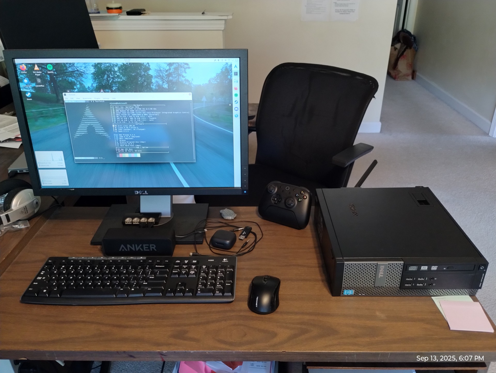
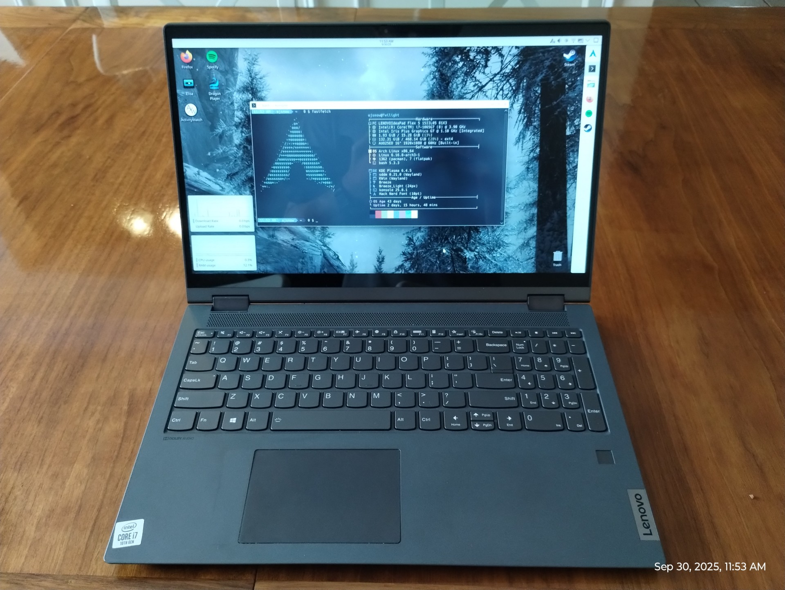
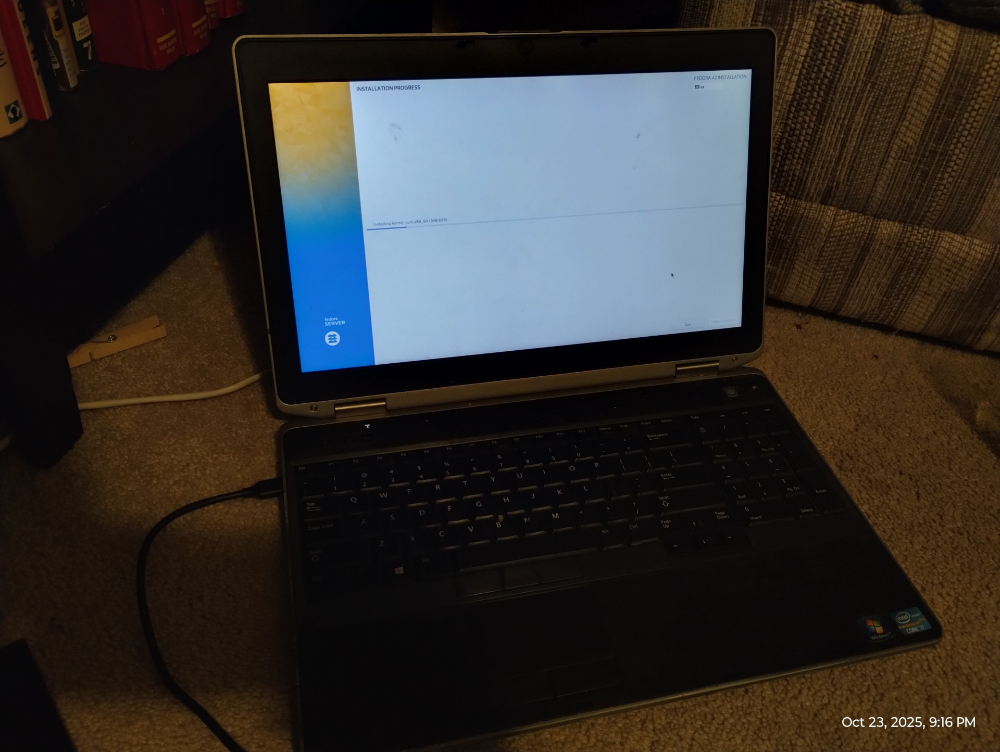

<!-- Home -->
<article role="tabpanel" id="home">

# Home

👋 Hi, I'm Ezra Snow, usually "EJSnow" online. I enjoy gaming, programming, and messing with Linux. I'm currently daily-driving Arch Linux, coming from Windows (though not directly, I explored several other Linux distros before landing on Arch). This site was written entirely on Arch btw. I'm also hopelessly nostalgic for Windows 7 (this site is evidence of that lol).

My main PC ([Details and specs](projects/2024-10-05-redstone-computer/)):

</article>

<!-- About me -->
<article role="tabpanel" id="about-me" hidden>

# About me

I'm Ezra Snow, a nerdy (extremely) 17 year old guy who may be addicted to computers and Linux (I spend far too much time using and messing with Linux on my computer). I currently live in North Carolina, and I'm a senior in high school. After I graduate, I'm going to study computer science at LeTourneau University. When I'm not doing school or messing with Linux, I'm often playing video games or programming.

I am also mildly interested in self-hosting things. One thing I definitely want to do is self-host this website, and also probably set up a NAS or something. I do not currently have a domain though, so I can't do much yet (I really should get a domain it's not even very expensive). \*sigh\* Maybe someday. For now I mess about in the LAN on my PC.

Games I like (in no particular order):

* The Elder Scrolls V: Skyrim
* Forza Horizon 4
* Geometry Dash
* Hollow Knight
* Minecraft
* Just Shapes and Beats

Fun fact: I wrote parts of this section on my phone by ssh-ing into my PC. <a target="_blank" href="https://termux.dev">Termux</a> is wonderful (The vast majority was written either on my PC or my laptop though).

## My computers

*Select any image below to view it full size*

### The Redstone Computer

My main PC, that I use for gaming, some web development, and pretty much everything else that isn't schoolwork (including Windows nostalgia). I built it over a year ago and it's worked really well, despite its age. See more details [here](projects/2024-10-05-redstone-computer/).

Specs (original → upgraded):

* CPU: Intel Core i5-4590 → Intel Core i7-4790
* RAM: 8GB (2x4GB) DDR3 → **Crucial 16GB (2x8GB) DDR3**
* GPU: Intel HD 4600 (iGPU) → **Radeon RX 6400 (dGPU)**
* Storage: 128GB 2.5" SSD → **500GB Crucial MX500 2.5" SSD + 1TB Western Digital Blue 2.5" HDD**
* OS: **Arch Linux** + Windows 10 Pro

Items in bold are considered to be significant upgrades.

### Twilight

A Lenovo Ideapad Flex 5-15IIL05 laptop I got for free in August 2025 from my grandparents. The keyboard was mostly dead due to a lot of dirt finding its way into it, so they had gotten a new laptop and gave this one to me. After doing a deep clean of the keyboard, it works great now. I use it for school and general messing around when I don't want to sit down at my PC. It's even capable of lightweight gaming; it runs Minecraft and Geometry Dash very well (also JSAB and Hollow Knight run solidly too). It can even run Skyrim at 720p and extremely low settings, but it can't run much beyond that. It's kind of insane for a free laptop. The battery is even still pretty good, at least in Arch Linux (it's significantly worse in Windows).

Specs:

* CPU: Intel Core i7-1065G7
* RAM: 16GB LPDDR4
* GPU: Intel Iris Plus G7 (iGPU)
* Storage: Smasnug PM991 512GB NVMe SSD
* OS: Windows 10 Home → Windows 11 Home → **Arch Linux**

### The Minecraft server (not anymore though)

This laptop has been in my family for a long time, and from 2022-2024 it was the kids' laptop (but mostly mine). It was originally my mom's, but she got a new computer a while ago, and this laptop came to me. Technically, it was only for school, but it was also my introduction to computers, Windows, PC gaming (despite the fact that it can't play very many games), and I even started playing around with Linux on it towards the end. I also put an SSD and more RAM in it, which improved it a bit but not nearly enough. Before I started messing with Linux, I played around with Windows 7, first in a VM (which was horrendously slow), and then I set up a dual-boot with Windows 10. Windows 7 was actually really good on that laptop.

In October 2024 this laptop was retired after I built the Redstone Computer. I resurrected it in February 2025 as a small Minecraft server and it actually wasn't too bad for that. However, that server is long dead, and the laptop is hiding in my closet, waiting for the day when I resurrect it as a Windows 7 nostalgia PC.

Specs:

* CPU: Intel Core i7-3540M
* RAM: 8GB DDR3 → 16GB DDR3
* GPU: Intel HD 4000 (iGPU)
* Storage: 750GB Western Digital Scorpio Black 2.5" HDD → 500GB Crucial MX500 2.5" SSD
* OS: Windows 7 Professional → Windows 10 Pro → Linux Mint 22 → Debian 12 → Fedora Server 42

</article>
<!-- My projects -->
<article role="tabpanel" id="blog" hidden>

# Blog

Idk why not have a blog lol. I will probably not post here too often.

<ul class="posts">

    <li><h3>{{ post.data.title }}</h3><small>Last updated {{ post.data.lastUpdated }} • Created {{ post.page.date | dateOnly }}</small>
{{ post.page.excerpt }}

<a href="{{ post.page.url }}">View</a>
</li>

</ul>
</article>
<!-- Resources for various purposes -->
<article role="tabpanel" id="resources" hidden>

# Resources

Things I have for future reference; they're on here because this makes them easy to access from anywhere. These mostly aren't general purpose guides; check official documentation (like the [ArchWiki](https://wiki.archlinux.org)) or other locations of good repute for those. ;)

## Linux stuff

<ul class="posts">

    <li><h3>{{ resource.data.title }}</h3><small>Last updated {{ resource.data.lastUpdated }} • Created {{ resource.page.date | dateOnly }}</small>
{{ resource.page.excerpt }}

<a href="{{ resource.page.url }}">View</a>
</li>

</ul>

</article>
